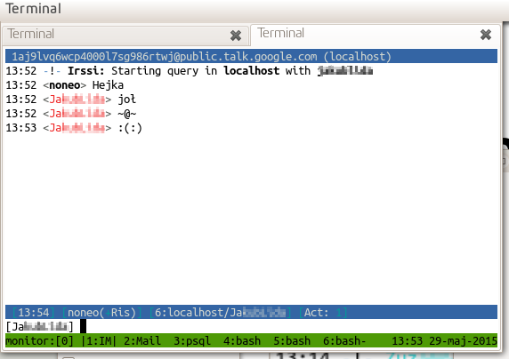

class: center, middle, inverse

# The terminal

.footnote[[Online version](https://github.com/diarized/how-to-in-cli)]

---

# Why

* no distraction

???

General discussion about the history, simplicity, low-bandwith, low-resources features of terminal aka command line.

---

# Why

* .grey[no distraction]
* mouseless (keyboard only)

---

# Why

* .grey[no distraction]
* .grey[mouseless (keyboard only)]
* no resource hungry

---

# Why

* .grey[no distraction]
* .grey[mouseless (keyboard only)]
* .grey[no resource hungry]
* alomst everywhere (even in Windows)

---

# Basic tools

## SSH
* new telnet (the idea of work on central shared systems)
* key-agent (removing authentication with password, but if  you trust source wks)

---

# Basic tools

## Tmux
* many parallel sesions
* splitting the screen
* screen sharing
* simultaneous sessions to many servers

---

# Everyday tasks

* Mail
* Chat
* Task management

---

class: center, middle, inverse

# Mail

---

class: center, middle, inverse

# Where

---

# Reading with IMAP

How to configure Mutt to read directly from IMAP server

???

How to use Mutt to read remote inbox on Gmail server 

---

# Reading with IMAP

```
  1 source $HOME/.muttrc_common
  2 
  3 set folder = imaps://imap.gmail.com:993/
  4 set spoolfile = +INBOX
  5 set record = "+[Gmail]/Sent Mail"
  6 set postponed = "+[Gmail]/Drafts"
  7 set mbox = "+[Gmail]/All Mail"
  8 
  9 mailboxes = 'INBOX' \
 10             '=[Gmail]/Sent Mail'
 11 
 12 set smtp_url="smtp://artur@stonith.pl@smtp.gmail.com:587/"
 13 set smtp_pass = `pass show stonith`
 14 
 15 set imap_user = 'artur@stonith.pl'
 16 set imap_pass = $smtp_pass
```

???

Back ticks are not visible in presentation mode.

---

# Source of e-mails

## Mail gathering
* Local delivery (postfix/exim server)

???

Home server, VPS. Geeks keep mail on many different systems far from Gmail/Yahoo.

---

# Source of e-mails

## Mail gathering
* .grey[Local delivery (postfix/exim server)]
* Transfering and performing other commands over IMAP(rotocol)

---

class: center, middle, inverse

# Filtering/sorting

---

# Filtering/sorting

* Procmail filters and sorts into folders with local delivery

---

# ~/.procmailrc


```
  7 LOGFILE=$MAILDIR/procmail.log
  8 VERBOSE=yes
  9 DELIVER="/usr/lib/dovecot/deliver"
 10 
 11 :0cD
 12 * ^Subject: remi
 13 | $HOME/src/reminder_client.py
 14 
 15 :0c
 16 | $HOME/local/bin/notmuch new
 17 
 18 :0w
 19 * ^X-Spam-Status: Yes
 20 | $DELIVER -m .Spam/
 21 
 22 :0
 23 * ^From.*@funfile.org
 24 .mdir-funfile/
```

???

:0c clones an email and processes it without waiting for exit code

:0cD as above but rule is case sensitive

:0w flag says to wait for the program in the action line to finish

:0 just tries to match. Incase of success it interrupts.

---

# Procmail logs

```
procmail: [23198] Fri May 29 01:16:15 2015
procmail: No match on "^Subject: remi"
procmail: Assigning "LASTFOLDER=/home/artur/local/bin/notmuch new"
procmail: No match on "^X-Spam-Status: Yes"
procmail: No match on "^From.*@funfile.org"
procmail: No match on "^(From|To|Cc).*pgsql-hackers@postgresql.org"
procmail: No match on "^(From|To|Cc).*pgsql-announce@postgresql.org"
procmail: No match on "^(From|To|Cc).*pgsql-performance@postgresql.org"
procmail: Match on "^(From|To|Cc).*python-dev@python.org"
procmail: Executing "/home/artur/local/bin/notmuch,new"
procmail: [23198] Fri May 29 01:16:16 2015
procmail: Assigning "LASTFOLDER=.mdir-python-dev/new/1432854975.23198_0.monitor"
```

---

# Filtering/sorting

* .grey[Procmail filters and sorts into folders with local delivery]
* IMAPfilter filters and sorts e-mails on remote system using IMAProtocol

---

#IMAPfilter

* Config in Lua

---

#IMAPfilter

* .grey[Config in Lua]
* Works for remote/remote or remote/local mailboxes

---


# IMAPFilter - account definition

```
19 myuser = 'artur'
20 local cmd = '/home/arkamins/local/bin/pass myvpsmail'
21 local fd = io.popen(cmd, 'r')
22 pass_string = fd:read("*a")
23 fd:close()
25 mypass = pass_string:sub(0, -2)
27 
28 MYVPS = IMAP {
29     server = 'imap.myvps.com',
30     username = myuser,
31     password = mypass,
32     ssl = 'tls'
33 }
```
---

# Password in IMAPfilter

This method requires running key agent with quite long TTL to make it convenient.

---

# IMAPFilter - SELECT

```
35 recent = MYVPS.INBOX:is_newer(1)
36 messages = recent:contain_from('prof@(math.)?school.edu') +
37            recent:contain_to('prof@(math.)?school.edu')
38 messages:move_messages(MYVPS['INBOX/school'])
```
  
---

class: center, middle, inverse

# E-mail downloading

---

# E-mail downloading

* OfflineIMAP - Python tool to download from IMAP servers

---

# E-mail downloading

* .grey[OfflineIMAP - Python tool to download from IMAP servers]
* ~/offlineimaprc - config file parsed as Python script

---

# E-mail downloading

* .grey[OfflineIMAP - Python tool to download from IMAP servers]
* .grey[~/offlineimaprc - config file parsed as Python script]
* run from crontab or in background with specified frequency

---

# OfflineIMAP config - custom functions

```
1 [general]
2 accounts = MyRemoteIMAP
3 ui = TTYUI
4 fsync = True
5 pythonfile=~/.offlineimap/password_store.py
```

---

# OfflineIMAP config - indexing

```
 15 [Account MyServerIMAP]
 16 localrepository  = MyServer_local
 17 remoterepository = MyServer_remote
 18 status_backend = sqlite
 19 postsynchook = /home/artur/local/bin/notmuch new
 20 #autorefresh = 2
```

---

# OfflineIMAP config - passwords

```
 22 [Repository MyServer_remote]
 23 type = IMAP
 24 remotehost = imap.myvps.com
 25 remoteport = 993
 26 remoteuser = artur
 27 remotepasseval = mailpass('myvpsmail')
```


---

class: center, middle, inverse

# Indexing e-mails

---

# Full text indexing

* [notmuch](http://notmuchmail.org/)

---

# Full text indexing

* .grey[notmuch]
* Xapian

---

# Full text search

* Mutt custom macro 'mutt-notmuch.py'
* fork of honza@github script: [diarized/mutt-notmuch-py](https://github.com/diarized/mutt-notmuch-py)

---

# Full text search - muttrc

```
macro index / "<enter-command>unset wait_key<enter><shell-escape>mutt-notmuch.py \
  -G /home/artur/Maildir<enter><change-folder-readonly>~/.mutt/cache_mutt_results<enter>" \
  "search mail (using notmuch)"
```

---

class: center, middle, inverse

# Password management

---

# Password management

* [Password-store](http://git.zx2c4.com/password-store/about/) - keeping passwords out of config files

???

Bash script.
Easy to debug and improve

---

# Password management

* .grey[Password-store]
* Combined with Pretty GNU Privacy (PGP key infrastructure + key agent)

---

# Password management

* .grey[Password-store]
* .grey[Combined with Pretty GNU Privacy (PGP key infrastructure + key agent)]

More on PGP key agents on next slides.

---

class: center, middle, inverse

# Chatting in terminal

---

# Irssi as the client

* Well known IRC protocol

???

Not only Irssi - many other, for GUI too.


---

# Irssi as the client

* .grey[Well known IRC protocol]
* Familiar IRC client interface

---

# Irssi as the client

* .grey[Well known IRC protocol]
* .grey[Familiar IRC client interface]
* Gateway?

---

# Chat protocol <-> IRC

Bitlbee

---

# Chat protocol <-> IRC

Bitlbee - daemon that converts IRC commands
```
~/local/sbin/bitlbee \
  -P ~/local/var/run/bitlbee.pid \
  -c ~/local/etc/bitlbee/bitlbee.conf \
  -d ~/local/etc/bitlbee/
```

---

# Log in Google Talk


---

# A chat with Google contact



---

class: center, middle, inverse

# Task management

---

